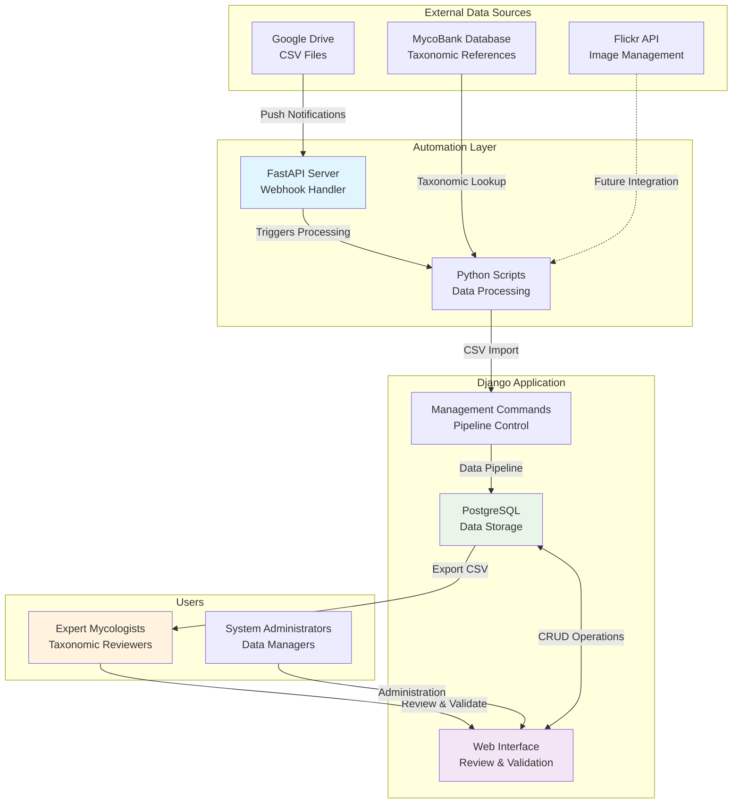
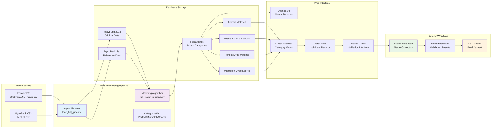
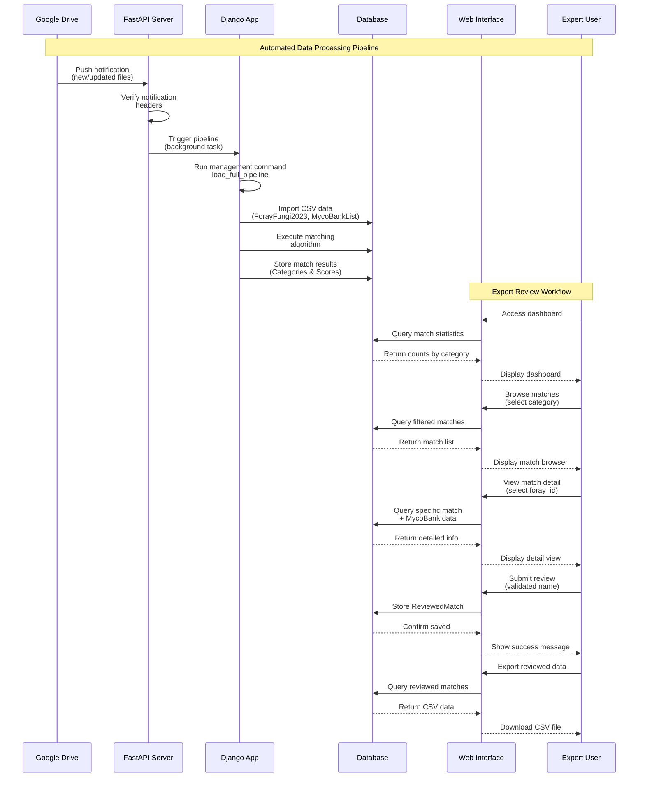
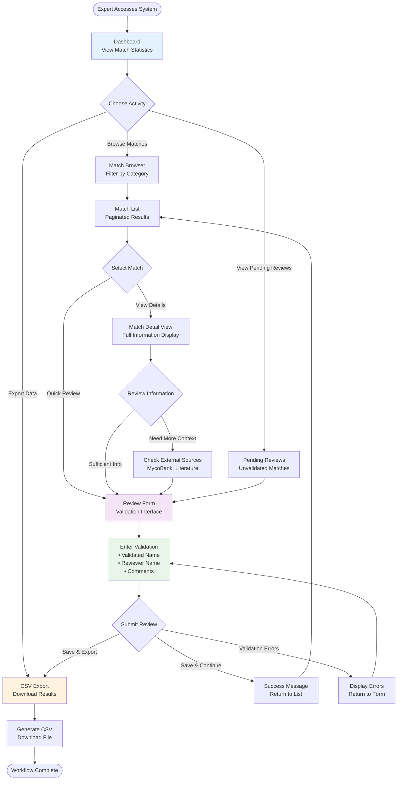
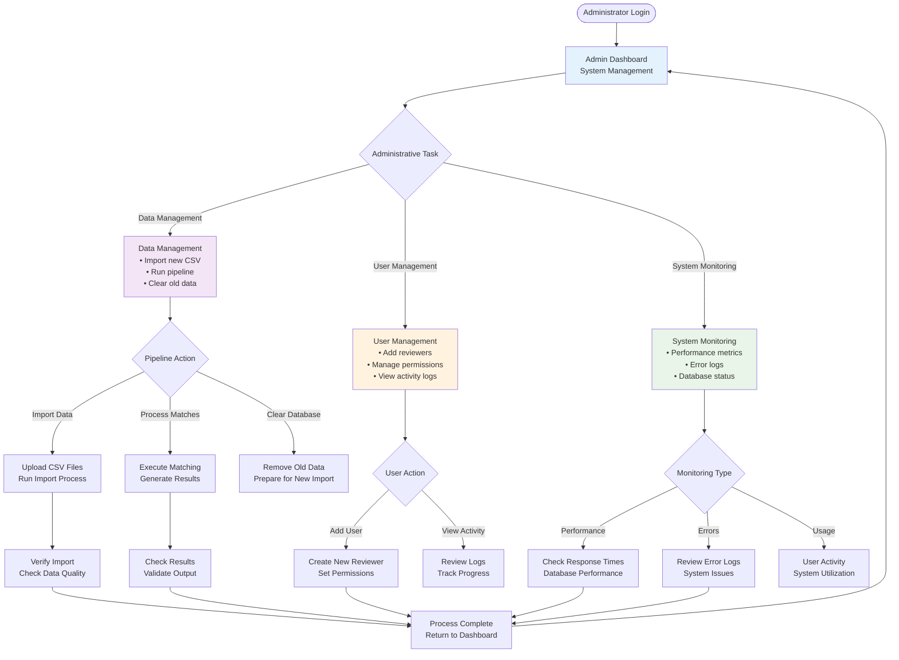
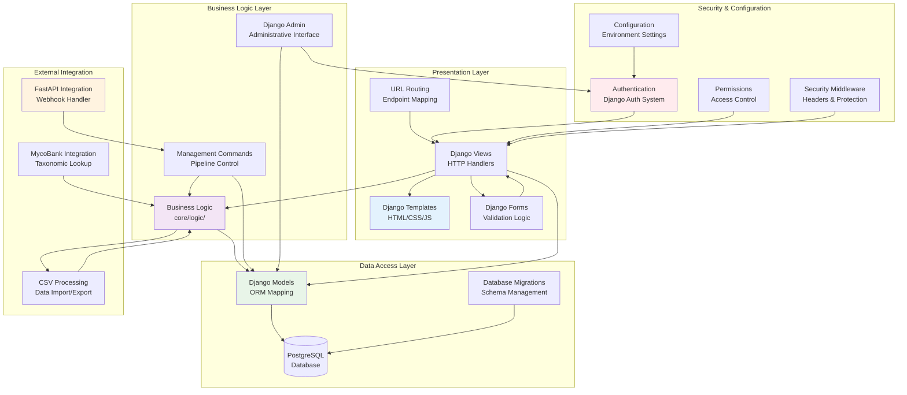

# Architecture Overview

## System Design

The ForayNL2025 Django application is designed as a taxonomic validation system that processes fungal collection data and facilitates expert review of species identifications.

## System Overview



## Application Structure

```
FORAY_DJANGO/
├── config/                 # Django configuration
│   ├── settings.py        # Application settings
│   ├── urls.py           # Main URL routing
│   └── wsgi.py           # WSGI application entry
├── core/                   # Main application logic
│   ├── models.py          # Data models
│   ├── views.py          # HTTP request handlers
│   ├── forms.py          # Form definitions
│   ├── admin.py          # Django admin configuration
│   ├── urls.py           # Application URL routing
│   ├── templates/        # HTML templates
│   ├── logic/            # Business logic
│   ├── management/       # Django management commands
│   └── migrations/       # Database migrations
└── data/                  # Static data files
    ├── 2023ForayNL_Fungi.csv
    └── MBList.csv
```

## Data Flow Architecture



## Core Components

### 1. Data Import Layer
- **Purpose**: Process CSV files containing foray collection data
- **Components**: Management commands, CSV parsing logic
- **Data Sources**: ForayNL field collection data, MycoBank taxonomic records

### 2. Matching Engine
- **Purpose**: Compare foray specimens with MycoBank taxonomic database
- **Algorithm**: String similarity matching with configurable thresholds
- **Output**: Categorized matches (perfect, mismatch, all_match)

### 3. Review Interface
- **Purpose**: Provide web UI for expert taxonomic validation
- **Features**: Dashboard, detail views, validation forms, export functions
- **Users**: Mycologists, taxonomic experts, research coordinators

### 4. Data Management
- **Purpose**: Store and organize matching results and validations
- **Storage**: PostgreSQL database with proper relationships
- **Versioning**: Track reviewer information and validation history

## Integration Points

### External Systems Integration



### External System Details
- **FastAPI Server**: Handles Google Drive push notifications and triggers automated processing
- **Google Drive**: Source for new data files with webhook integration
- **Flickr API**: Image management (separate automation system, future integration)
- **MycoBank Database**: Taxonomic reference data for species validation

## Technology Stack

### Backend
- **Django 4.0+**: Web framework
- **Python 3.8+**: Programming language
- **PostgreSQL**: Production database (SQLite for development)
- **Gunicorn**: WSGI server for production

### Frontend
- **Django Templates**: Server-side rendering
- **Bootstrap CSS**: UI framework
- **JavaScript**: Client-side interactions
- **CSV Export**: Data download functionality

### Infrastructure
- **Docker**: Containerization (recommended)
- **nginx**: Reverse proxy and static file serving
- **SSL/TLS**: HTTPS encryption
- **Environment Variables**: Configuration management

## Security Architecture

### Authentication & Authorization
- **Django Admin**: Built-in administrative interface
- **Session Management**: Django's session framework
- **CSRF Protection**: Cross-site request forgery prevention
- **XSS Protection**: Cross-site scripting prevention

### Data Protection
- **Input Validation**: Form-based validation and sanitization
- **SQL Injection Prevention**: Django ORM protection
- **File Upload Security**: Type and size restrictions
- **Environment Configuration**: Secure settings management

### Network Security
- **HTTPS Enforcement**: SSL/TLS for all traffic
- **Security Headers**: HSTS, XSS protection, content type sniffing prevention
- **Host Validation**: ALLOWED_HOSTS configuration
- **Database Encryption**: Connection security

## Performance Considerations

### Database Optimization
- **Indexes**: Strategic indexing on frequently queried fields
- **Query Optimization**: Efficient ORM usage
- **Connection Pooling**: Database connection management
- **Bulk Operations**: Efficient data processing for large datasets

### Caching Strategy
- **Django Cache Framework**: Page and query caching
- **Static Files**: CDN or optimized serving
- **Database Caching**: Query result caching
- **Session Optimization**: Efficient session storage

### Scalability Planning
- **Horizontal Scaling**: Load balancer support
- **Database Scaling**: Read replicas and connection pooling
- **Background Processing**: Celery for heavy operations (if needed)
- **File Storage**: Separate static/media file serving

## Error Handling & Monitoring

### Logging Strategy
```python
LOGGING = {
    'version': 1,
    'handlers': {
        'file': {
            'level': 'INFO',
            'class': 'logging.FileHandler',
            'filename': 'logs/django.log',
        },
        'security': {
            'level': 'WARNING',
            'class': 'logging.FileHandler', 
            'filename': 'logs/security.log',
        },
    },
    'loggers': {
        'django': {'handlers': ['file'], 'level': 'INFO'},
        'django.security': {'handlers': ['security'], 'level': 'WARNING'},
        'core': {'handlers': ['file'], 'level': 'DEBUG'},
    },
}
```

### Error Recovery
- **Database Transactions**: ACID compliance for data integrity
- **Backup Strategy**: Regular automated backups
- **Health Checks**: Application monitoring endpoints
- **Graceful Degradation**: Fallback behaviors for failures

## Deployment Architecture

### Development Environment
```
Local Machine → SQLite → Django Development Server → localhost:8000
```

### Production Environment
```
Internet → Load Balancer → nginx → Gunicorn → Django App → PostgreSQL
                    ↓
                Static Files → CDN/nginx
```

### Container Architecture (Recommended)
```
Docker Container:
├── nginx (reverse proxy)
├── gunicorn (WSGI server)
├── Django application
└── PostgreSQL (or external DB)
```

## API Design (Future Considerations)

### RESTful Endpoints (Not Yet Implemented)
- `GET /api/matches/` - List all matches
- `GET /api/matches/{id}/` - Get specific match
- `POST /api/review/` - Submit review
- `GET /api/export/` - Export validated data

### Authentication (Future)
- Token-based authentication
- API key management
- Rate limiting
- CORS configuration

## User Interface Workflows

### Expert Review Workflow



### Administrative Workflow



## Component Architecture

### Django Application Components



## Configuration Management

### Environment-Based Configuration
```python
# Development
DEBUG = True
DATABASE_URL = 'sqlite:///db.sqlite3'
ALLOWED_HOSTS = ['localhost', '127.0.0.1']

# Production  
DEBUG = False
DATABASE_URL = 'postgresql://user:pass@db:5432/foray_db'
ALLOWED_HOSTS = ['foray.example.com']
```

### Settings Organization
```python
# settings/
├── base.py      # Common settings
├── development.py  # Development overrides
├── production.py   # Production overrides
└── testing.py      # Test environment
```

## Testing Strategy

### Test Categories
- **Unit Tests**: Model and form validation
- **Integration Tests**: View and URL routing
- **Functional Tests**: Complete user workflows
- **Security Tests**: Authentication and authorization

### Test Structure
```
tests/
├── test_models.py      # Data model tests
├── test_views.py       # HTTP view tests
├── test_forms.py       # Form validation tests
├── test_security.py    # Security configuration tests
└── test_pipeline.py    # Data processing tests
```

## Future Enhancements

### Short-term Improvements
- Comprehensive test suite implementation
- API endpoint development
- Enhanced error handling and logging
- Performance optimization

### Long-term Roadmap
- Real-time collaboration features
- Advanced matching algorithms
- Machine learning integration
- Multi-tenant support
- Mobile application development

---

This architecture provides a solid foundation for taxonomic data validation while maintaining security, scalability, and maintainability principles.