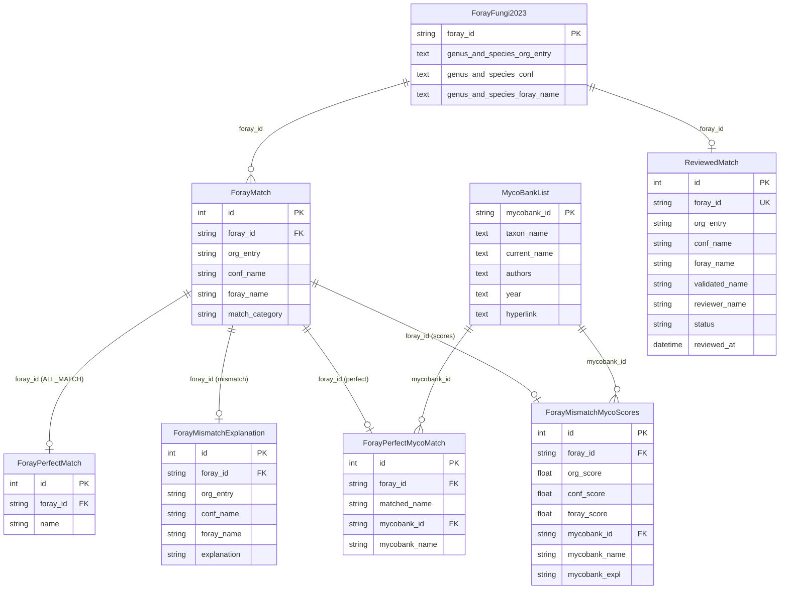
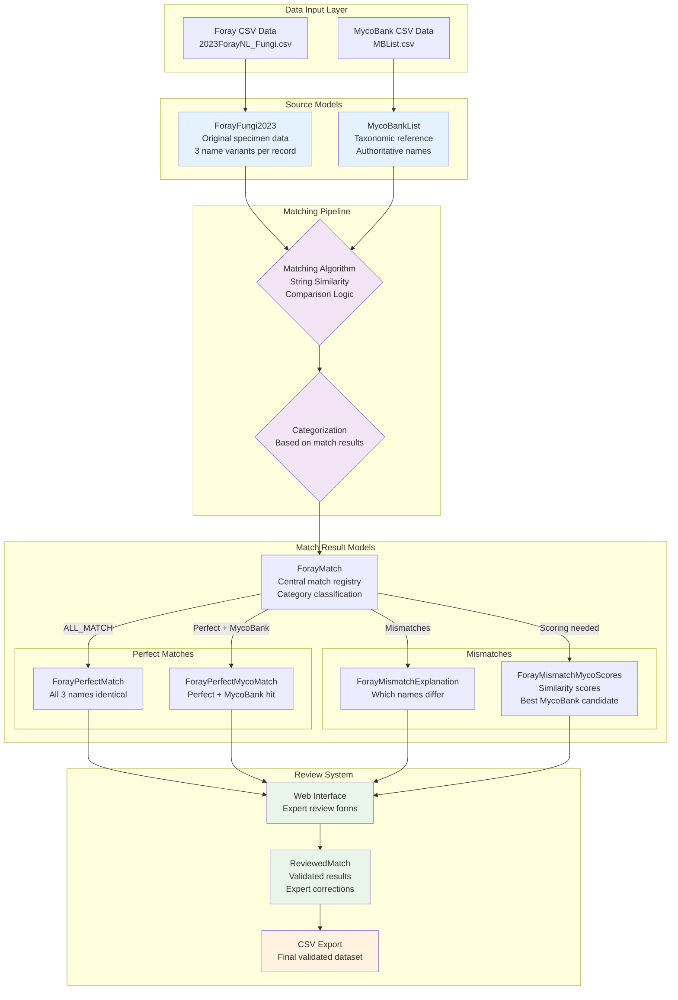

# Data Models and Relationships

## Database Schema Overview

The ForayNL2025 application uses a well-structured database schema designed around the taxonomic matching and review workflow. The schema is organized into three main categories:

1. **Source Tables**: Original data from Foray collections and MycoBank
2. **Match Artifacts**: Computed results from the matching pipeline
3. **Review Workflow**: Human validation and review tracking

## Entity Relationship Diagram



## Source Tables

### ForayFungi2023
**Purpose**: Stores original foray collection data with three different name variations per specimen.

```python
class ForayFungi2023(models.Model):
    foray_id = models.CharField(max_length=100, primary_key=True)
    genus_and_species_org_entry = models.TextField(null=True, blank=True)
    genus_and_species_conf = models.TextField(null=True, blank=True)  
    genus_and_species_foray_name = models.TextField(null=True, blank=True)
```

**Key Features**:
- Primary key: `foray_id` (unique specimen identifier)
- Three name variants per specimen reflecting different naming conventions
- Nullable fields accommodate incomplete data

**Data Example**:
```
foray_id: "F2023-001"
org_entry: "Agaricus campestris"
conf: "Agaricus campestris L."
foray_name: "Agaricus campestris (meadow mushroom)"
```

### MycoBankList
**Purpose**: Reference taxonomic data from MycoBank database.

```python
class MycoBankList(models.Model):
    mycobank_id = models.CharField(max_length=100, primary_key=True)
    taxon_name = models.TextField(null=True, blank=True)
    current_name = models.TextField(null=True, blank=True)
    authors = models.TextField(null=True, blank=True)
    year = models.TextField(null=True, blank=True)
    hyperlink = models.TextField(null=True, blank=True)
```

**Key Features**:
- Primary key: `mycobank_id` (official MycoBank identifier)
- `preferred_name` property prefers `current_name` over `taxon_name`
- Comprehensive taxonomic metadata including authors and year

**Data Example**:
```
mycobank_id: "MB123456"
taxon_name: "Agaricus campestris"
current_name: "Agaricus campestris L."
authors: "L."
year: "1753"
```

## Match Artifacts

### ForayMatch
**Purpose**: Central matching results table categorizing the relationship between the three foray name variants.

```python
class ForayMatch(models.Model):
    foray_id = models.CharField(max_length=100, db_index=True)
    org_entry = models.CharField(max_length=255)
    conf_name = models.CharField(max_length=255)
    foray_name = models.CharField(max_length=255)
    match_category = models.CharField(max_length=50, db_index=True)
```

**Match Categories**:
- `ALL_MATCH`: All three names are identical
- `MATCH_ORG_CONF`: org_entry matches conf_name
- `MATCH_ORG_FORAY`: org_entry matches foray_name  
- `MATCH_CONF_FORAY`: conf_name matches foray_name
- `ALL_DIFFERENT`: All three names differ

**Indexes**: 
- `foray_id` for specimen lookups
- `match_category` for filtering by match type

### ForayPerfectMatch
**Purpose**: Stores specimens where all three foray names are identical.

```python
class ForayPerfectMatch(models.Model):
    foray_id = models.CharField(max_length=100, db_index=True)
    name = models.CharField(max_length=255)
```

**Usage**: Quick access to specimens with consistent internal naming.

### ForayMismatchExplanation  
**Purpose**: Details for specimens with naming discrepancies.

```python
class ForayMismatchExplanation(models.Model):
    foray_id = models.CharField(max_length=100, db_index=True)
    org_entry = models.CharField(max_length=255)
    conf_name = models.CharField(max_length=255) 
    foray_name = models.CharField(max_length=255)
    explanation = models.CharField(max_length=100, db_index=True)
```

**Explanation Codes**:
- `ORG_CONF_MATCH`: org_entry and conf_name match (foray_name differs)
- `ORG_FORAY_MATCH`: org_entry and foray_name match (conf_name differs)
- `CONF_FORAY_MATCH`: conf_name and foray_name match (org_entry differs)
- `ALL_DIFFERENT`: All three names are different

### ForayPerfectMycoMatch
**Purpose**: Records with perfect internal match AND exact MycoBank correspondence.

```python
class ForayPerfectMycoMatch(models.Model):
    foray_id = models.CharField(max_length=100, db_index=True)
    matched_name = models.CharField(max_length=255)
    mycobank_id = models.CharField(max_length=100, db_index=True)
    mycobank_name = models.CharField(max_length=255)
```

**Usage**: High-confidence taxonomic identifications requiring minimal review.

### ForayMismatchMycoScores
**Purpose**: Similarity scores and best MycoBank matches for problematic specimens.

```python
class ForayMismatchMycoScores(models.Model):
    foray_id = models.CharField(max_length=100, db_index=True)
    org_score = models.FloatField()
    conf_score = models.FloatField()
    foray_score = models.FloatField()
    mycobank_id = models.CharField(max_length=100, blank=True, null=True)
    mycobank_name = models.CharField(max_length=255, blank=True, null=True)
    mycobank_expl = models.CharField(max_length=32, blank=True, null=True)
```

**Scoring**: Float values (0.0-1.0) representing string similarity between foray names and MycoBank records.

**MycoBank Explanation Examples**:
- `ORG → UPDATED`: org_entry matched current_name
- `CONF → TAXON`: conf_name matched taxon_name
- `FORAY → UPDATED`: foray_name matched current_name

## Review Workflow

### ReviewedMatch
**Purpose**: Tracks human expert review and validation decisions.

```python
class ReviewedMatch(models.Model):
    foray_id = models.CharField(max_length=64, db_index=True, unique=True)
    org_entry = models.CharField(max_length=255, blank=True, null=True)
    conf_name = models.CharField(max_length=255, blank=True, null=True)
    foray_name = models.CharField(max_length=255, blank=True, null=True)
    validated_name = models.CharField(max_length=255, blank=True, null=True)
    reviewer_name = models.CharField(max_length=128, blank=True, null=True)
    status = models.CharField(max_length=10, choices=STATUS_CHOICES, default="REVIEWED")
    reviewed_at = models.DateTimeField(auto_now=True)
```

**Status Values**:
- `REVIEWED`: Expert validation complete, removed from queue
- `PENDING`: Awaiting review or reopened for additional validation  
- `SKIPPED`: Temporarily bypassed during review process

**Key Features**:
- Unique constraint on `foray_id` prevents duplicate reviews
- `auto_now=True` on `reviewed_at` tracks last modification
- Optional `validated_name` allows expert correction of taxonomic identification

## Data Relationships

### Primary Relationships
1. **ForayFungi2023 → ForayMatch**: One-to-many via `foray_id`
2. **ForayMatch → Match Artifacts**: One-to-many based on `match_category`
3. **MycoBankList → Match Results**: One-to-many via `mycobank_id`
4. **ForayFungi2023 → ReviewedMatch**: One-to-one via `foray_id`

### Data Processing Flow



## Database Indexes and Performance

### Strategic Indexing
- **foray_id**: Primary lookup field across all match tables
- **match_category**: Enables efficient filtering by match type
- **mycobank_id**: Fast MycoBank record association
- **status**: Quick filtering of review queue
- **reviewed_at**: Chronological sorting of reviews

### Query Optimization Patterns
```python
# Efficient queries using indexes
perfect_matches = ForayMatch.objects.filter(match_category='ALL_MATCH')
pending_reviews = ReviewedMatch.objects.filter(status='PENDING')
recent_reviews = ReviewedMatch.objects.order_by('-reviewed_at')[:10]
```

## Data Integrity and Constraints

### Referential Integrity
- Foreign key relationships maintain data consistency
- Unique constraints prevent duplicate reviews
- NOT NULL constraints ensure required data presence

### Business Logic Constraints
- `foray_id` must exist in ForayFungi2023 before creating matches
- `mycobank_id` references must be valid MycoBank identifiers
- Review status transitions follow defined workflow rules

### Data Validation
- String length limits prevent oversized data
- Choice fields restrict status values to defined options
- Float fields for scores ensure numeric similarity values

## Migration Strategy

### Current Schema Version
- Initial migration: `0001_initial.py`
- All tables created with proper relationships and indexes

### Future Migration Considerations
- Add constraints for data integrity
- Implement soft delete functionality
- Enhanced audit trail with change tracking
- Performance indexes based on query patterns

---

This schema design provides a robust foundation for taxonomic data processing while maintaining clear separation between source data, computed results, and human validation workflows.