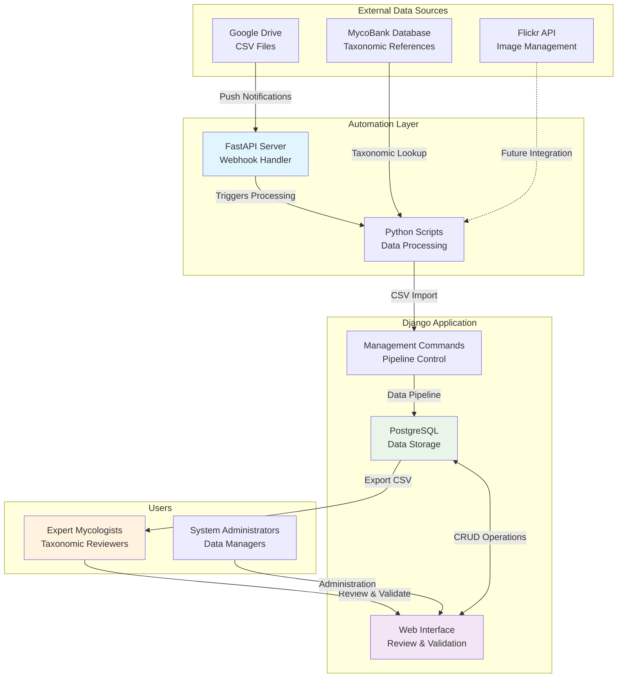
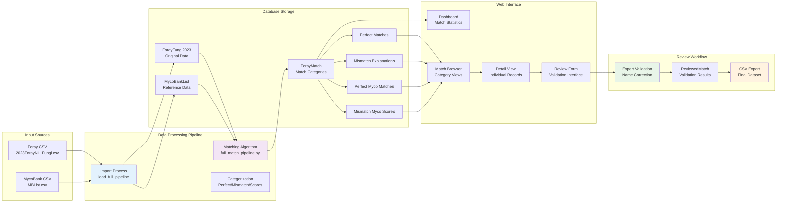
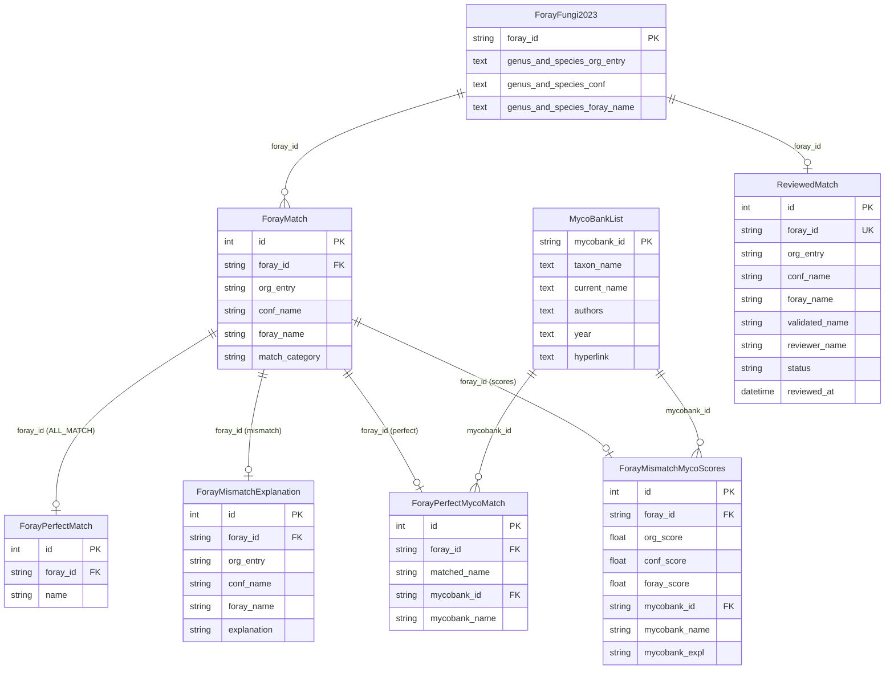
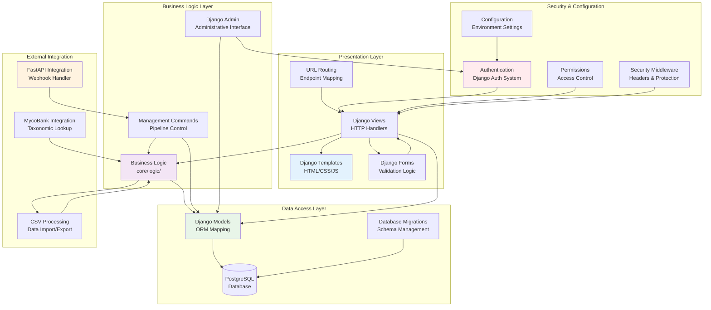
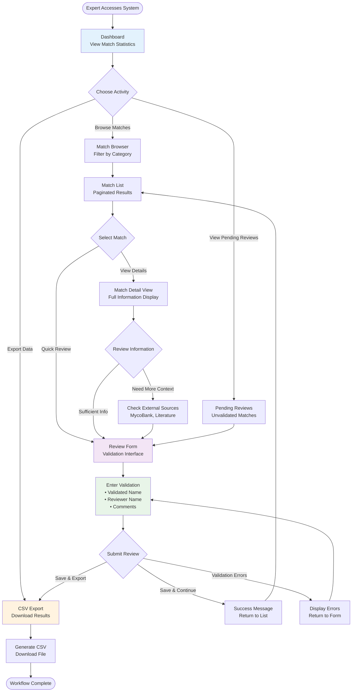
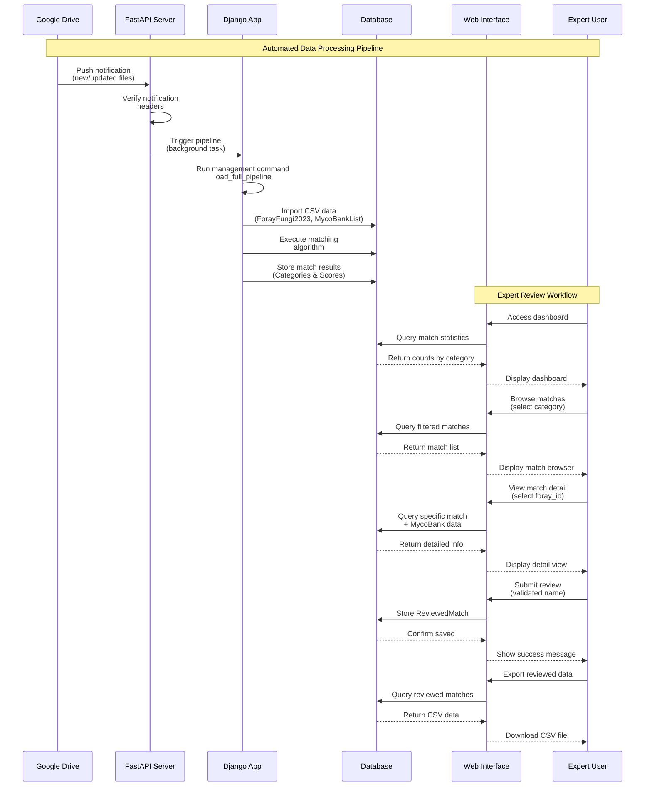
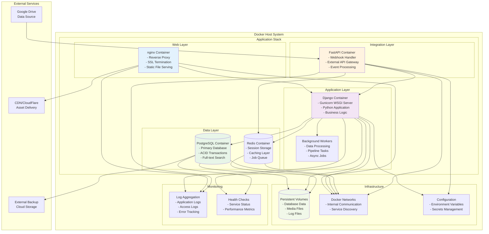

# ForayNL2025 Visual Architecture Guide

This document provides a comprehensive visual overview of the ForayNL2025 Django application architecture using Mermaid diagrams. Each diagram illustrates different aspects of the system's design, connections, and workflows.

## 📊 Diagram Index

### System Architecture Diagrams
1. [System Overview](#system-overview) - High-level external connections
2. [Data Flow Pipeline](#data-flow-pipeline) - Processing workflow
3. [Database Relationships](#database-relationships) - Data model connections
4. [Component Architecture](#component-architecture) - Internal system structure

### User Interface Diagrams
5. [Expert Review Workflow](#expert-review-workflow) - User interaction flows
6. [Administrative Workflow](#administrative-workflow) - Admin processes

### Integration Diagrams
7. [External Systems Integration](#external-systems-integration) - Service communication
8. [Container Architecture](#container-architecture) - Docker deployment

## System Overview

**Key Connections:**
- **External Data Flow**: Google Drive → FastAPI → Django Management Commands → Database
- **User Interactions**: Experts ↔ Web Interface ↔ Database
- **Administrative Control**: System Admins → Web Interface → All System Components
- **Future Integration**: Flickr API (planned for image management)

## Data Flow Pipeline

**Processing Flow:**
1. **Input**: CSV files with foray and MycoBank data
2. **Import**: Django management command processes files
3. **Matching**: Algorithm compares foray names with MycoBank references  
4. **Categorization**: Results classified as perfect matches, mismatches, or scored similarities
5. **Review**: Web interface provides expert validation workflow
6. **Export**: Final validated dataset exported as CSV

## Database Relationships

**Key Relationships:**
- **Source Data**: ForayFungi2023 and MycoBankList store original imported data
- **Match Processing**: ForayMatch acts as central hub linking to specialized match result tables
- **Review System**: ReviewedMatch tracks expert validation with one-to-one mapping to ForayFungi2023
- **MycoBank Integration**: Perfect matches and scored matches reference MycoBank records

## Component Architecture

**Architecture Layers:**
- **Presentation**: Django templates, views, forms, and URL routing
- **Business Logic**: Core application logic, management commands, admin interface
- **Data Access**: Django ORM, models, database migrations
- **Integration**: External service connectors (FastAPI, CSV processing, MycoBank)
- **Security**: Authentication, permissions, configuration, security middleware

## Expert Review Workflow

**User Journey:**
1. **Entry**: Expert accesses dashboard with match statistics
2. **Navigation**: Choose between browsing matches, reviewing pending items, or exporting data
3. **Selection**: Browse categorized matches and select specific items for review
4. **Analysis**: View detailed match information and consult external sources if needed
5. **Validation**: Enter validated taxonomic name and reviewer information
6. **Completion**: Save review and continue with next match or export results

## External Systems Integration

**Integration Points:**
- **Google Drive → FastAPI**: Webhook notifications trigger automated processing
- **FastAPI → Django**: Background task execution for data pipeline
- **Django → Database**: All data operations and storage
- **Web Interface ↔ Users**: Complete review and validation workflow
- **Database → Export**: Final validated dataset generation

## Container Architecture

**Container Structure:**
- **Web Layer**: nginx handles SSL, static files, and request routing
- **Application Layer**: Django/Gunicorn serves the web application with background workers
- **Data Layer**: PostgreSQL for persistent data, Redis for caching and sessions
- **Integration Layer**: FastAPI handles external webhooks and API integrations
- **Infrastructure**: Persistent volumes, internal networks, and configuration management
- **Monitoring**: Log aggregation and health checking across all services

## 📋 Diagram Summary

### Key Architectural Insights

1. **Modular Design**: Clear separation between data processing, web interface, and external integrations
2. **Scalable Architecture**: Container-based deployment supports horizontal scaling
3. **Robust Data Flow**: Multi-stage processing from raw CSV to validated taxonomic data
4. **User-Centric Workflow**: Expert review interface designed for efficient validation
5. **External Integration**: Webhook-driven automation with Google Drive and MycoBank
6. **Security Considerations**: Multi-layered security from nginx to database access

### Connection Patterns

- **Synchronous Flows**: Web requests, database queries, form submissions
- **Asynchronous Flows**: Webhook processing, background jobs, data pipeline
- **Data Relationships**: Foreign key relationships maintain data integrity
- **Service Communication**: REST APIs, internal network calls, event-driven triggers

### Deployment Considerations

- **Container Orchestration**: Docker Compose for local development, Kubernetes for production
- **Data Persistence**: Volume mounts for database, media files, and logs
- **Network Security**: Internal networks isolate services, external access only through nginx
- **Configuration Management**: Environment variables and secrets for sensitive data
- **Monitoring & Logging**: Centralized logging with health checks for all services

---

This visual guide provides a comprehensive overview of the ForayNL2025 application architecture, illustrating the connections between internal components and external resources that enable taxonomic data validation and expert review workflows.